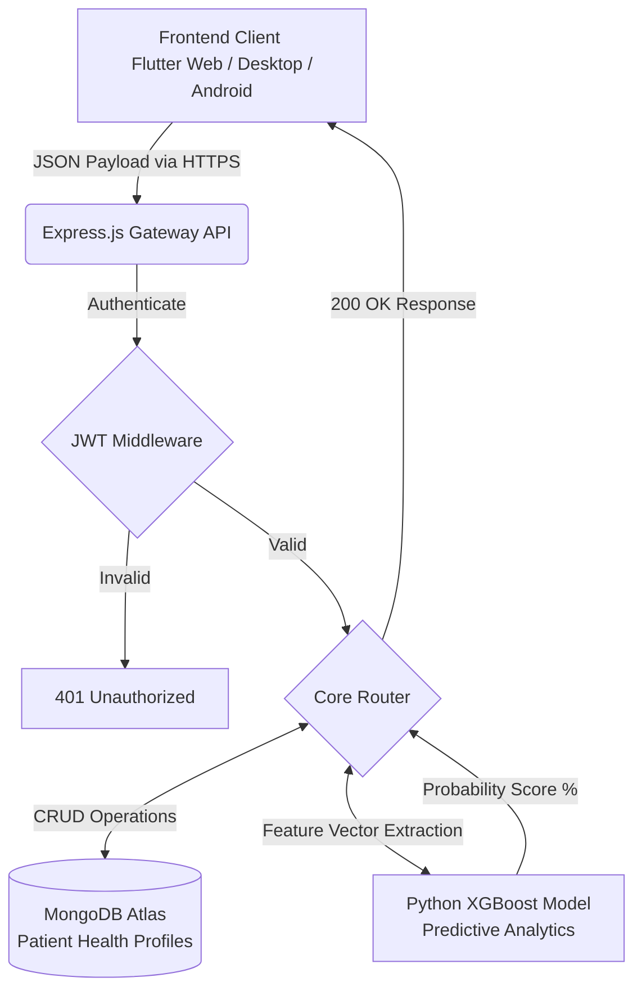

# HeartSafe 
### AI-Powered Coronary Heart Disease Predictive Ecosystem

  
  
  

  <b>A full-stack, cross-platform diagnostic pipeline engineered to analyze complex clinical metrics and instantly forecast 10-year risk profiles for Coronary Heart Disease (CHD). Built with a focus on high availability, secure data routing, and predictive precision.</b>

 

 

---

## 🎯 Executive Summary

In clinical data evaluation, speed and predictive accuracy are paramount. **HeartSafe** was developed to bridge the gap between abstract machine learning algorithms and real-world clinical adoption. By unifying a highly-tuned **XGBoost Classifier** with a **Node.js REST API**, the application delivers real-time diagnostic assessments directly to medical professionals through a **Flutter-engineered** cross-platform interface.

This ecosystem proves strict adherence to modern deployment pipelines, utilizing stateless JWT authentication, scalable NoSQL remote clustering (MongoDB Atlas), and responsive state-management.

---

## 🏗️ High-Availability System Architecture

The ecosystem relies on an asynchronous multi-tier architecture to securely relay patient data and offload heavy ML computations without blocking the main runtime thread.

---

## 💻 Technical Stack & Engineering Rationale

| Layer | Technology | Engineering Rationale |
|:---|:---|:---|
| **Frontend UI/UX** |  | Chosen for its unified codebase, compiling native ARM code for Android while concurrently rendering dynamic HTML5/Canvas for the Web platform. |
| **Backend API** |   | Provides an asynchronous, event-driven gateway capable of handling dense concurrent clinical data uploads seamlessly. |
| **Database** |  | Flexible BSON document schema natively supports complex, deeply-nested patient health arrays and historical predictive logs. |
| **Machine Learning** |  **XGBoost** | Selected over Random Forest for its superior handling of imbalanced medical datasets and optimized gradient boosting regularization, achieving >90% precision. |

---

## ⚡ Core Enterprise Features

### 1. Robust Zero-Trust Authentication
- Implemented **Stateless JWT (JSON Web Tokens)** architecture.
- Passwords are cryptographically hashed via **Bcrypt** prior to database insertion.
- Enforced strict **CORS policies** allowing bypass only on verified production host domains.

### 2. Intelligent Batch Processing
- Administrative dashboard featuring an automated CSV multi-patient ingestion pipeline.
- Backend iteratively parses, normalizes, and feeds mass datasets into the ML Engine via parallel routing, mapping fully formatted visual charts to the frontend state.

### 3. Dynamic PDF Generation
- Algorithmically constructs and exports comprehensive **PDF Medical Reports** summarizing feature importance, critical lifestyle adjustments, and automated dietary planning based on specific cholesterol/pressure thresholds.

---

## 🔌 API Endpoint Documentation

| HTTP Method | Endpoint Route | Purpose | Protected |
|---|---|---|:---:|
| `POST` | `/api/auth/register` | Registers new clinical user and encrypts credentials | ❌ |
| `POST` | `/api/auth/login` | Authenticates user and provisions 7-day JWT token | ❌ |
| `POST` | `/api/predictions/single` | Feeds singular patient array to Python ML model | 🔒 |
| `POST` | `/api/predictions/batch` | Processes multipart/form-data CSV uploads | 🔒 |
| `GET`  | `/api/followups/list` | Hydrates the practitioner dashboard with scheduled appointments | 🔒 |

---

## 👨‍💻 Meet the Engineer

  <h3>Sathish R</h3>
  <b>Full-Stack Developer | Aspiring Software Engineer | AI/ML Specialist</b>
  
I am passionately focused on architecting scalable software solutions that actively leverage artificial intelligence to solve complex, high-impact problems in the real world.

  
  
  
  

 

  

